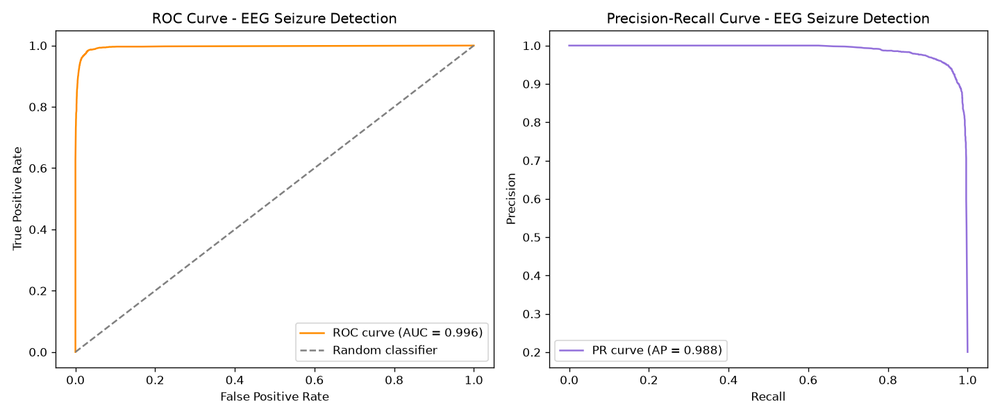
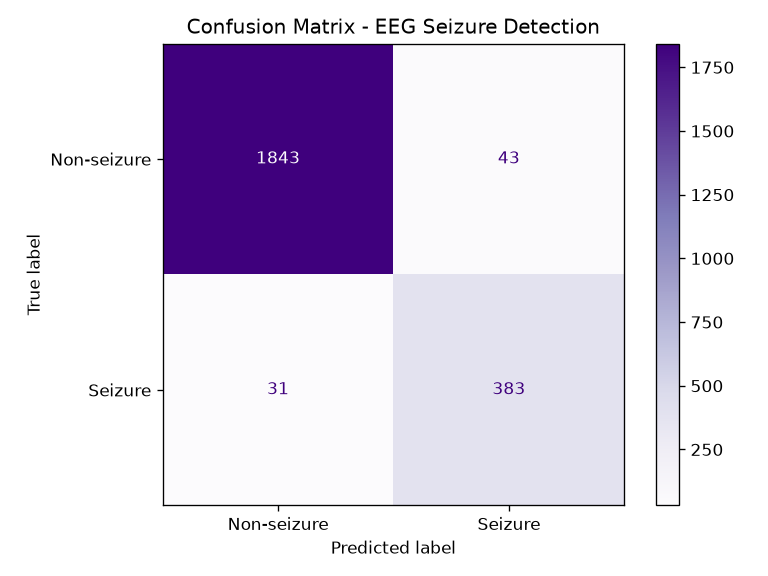
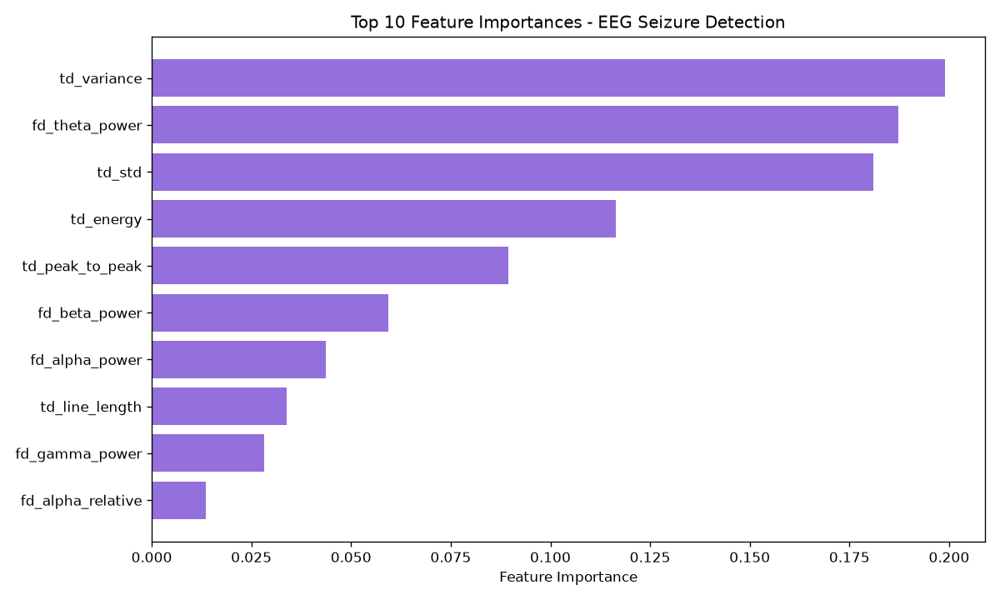
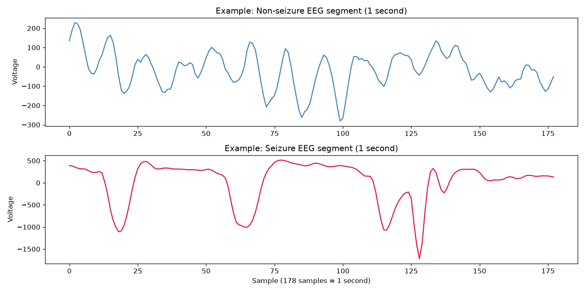
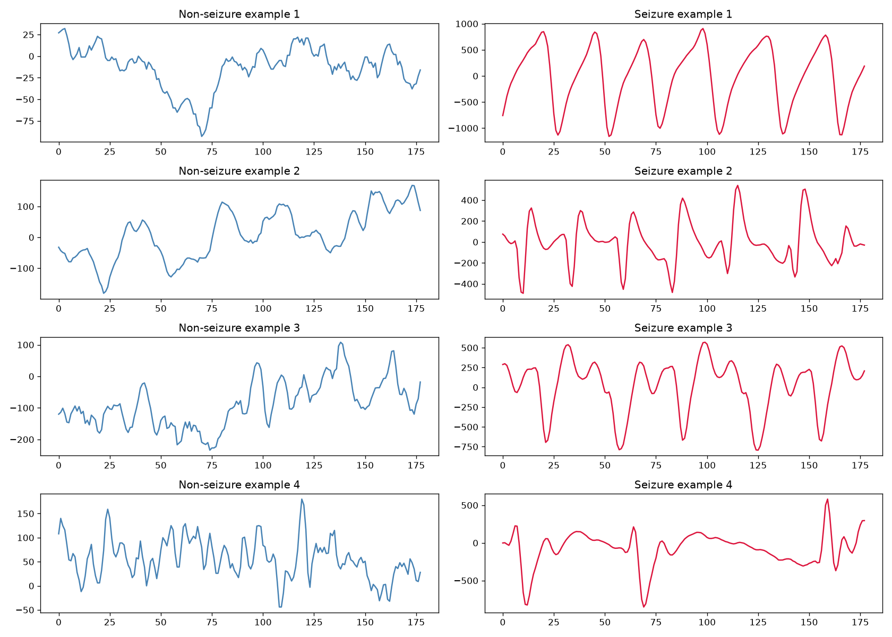

# EEG Seizure Detection

A signal processing and machine learning pipeline that classifies EEG segments as seizure or non-seizure activity, using the Epileptic Seizure Recognition dataset (UCI Machine Learning Repository, derived from the Bonn University EEG dataset). Built as a companion project to an ECG arrhythmia detection project, applying the same evaluation rigor, patient independent testing, to a different physiological signal type.

**Live demo:** both this project's model and the ECG project's model are combined into one interactive application: [biomechatronic-monitor.streamlit.app](https://biomechatronic-monitor.streamlit.app) ([app repository](https://github.com/bansidani-cmd/biomechatronic-monitor))

## Pipeline

1. Load the dataset, 11,500 one second EEG segments, 178 raw voltage readings each
2. Recover original patient grouping from the row identifier field, confirmed by inspecting the unique value counts of its embedded components
3. Binarize labels into seizure versus non-seizure
4. Extract time domain features: mean, standard deviation, variance, peak to peak range, line length, and total energy
5. Extract frequency domain features: power within each standard EEG band (delta, theta, alpha, beta, gamma) via FFT, both raw and as a proportion of total signal power, plus the single dominant frequency
6. Evaluate using patient grouped 5 fold cross validation, no patient's segments appear in both train and test within any fold
7. Report ROC and precision recall curves using out of fold predictions

## Results

5 fold patient grouped cross validation, seizure class:

| Metric | Value |
|---|---|
| Precision | 0.940 ± 0.042 |
| Recall | 0.961 ± 0.038 |
| F1 | 0.949 ± 0.021 |
| ROC AUC | 0.996 |
| Average Precision | 0.988 |





## Why performance is higher than the companion ECG project

The Bonn dataset segments used here come from intracranial electrodes placed directly over the seizure focus during clinical monitoring, an intentionally clean, high contrast benchmark. Published research on this dataset commonly reports accuracy in the 95 to 99 percent range for binary seizure classification, so this result is consistent with the literature rather than an anomaly. A companion ECG arrhythmia detection project on the same evaluation methodology reported meaningfully lower and more variable performance (F1 around 0.73), reflecting that arrhythmia presentation varies more subtly across patients than the large, distinct amplitude and rhythmicity shift seen during a seizure.

## Feature importance



Amplitude based features (variance, standard deviation, energy) and theta band power (4 to 8 Hz) dominate. This has a physiological basis: ictal activity is documented in the epilepsy literature as frequently showing prominent theta band rhythmicity, consistent with what the model independently identified as important.

## Signal examples





## Files

| File | Description |
|---|---|
| `eeg_step1_explore.py` | Data loading, patient grouping recovery, and initial signal visualization |
| `eeg_step2_features_classify.py` | Feature extraction and single train/test split classification |
| `eeg_phase1_cv_roc.py` | Patient grouped 5 fold cross validation, ROC and precision recall curves, model saving |
| `eeg_build_demo_model.py` | Trains a held out demonstration model, excluding demo patients entirely, for the live app |

## How to run

```bash
pip install pandas numpy scipy scikit-learn matplotlib joblib
python eeg_phase1_cv_roc.py
```

Dataset downloads automatically on first run.

## Companion project

[ECG Arrhythmia Detection](https://github.com/bansidani-cmd/ECG-arrhythmia-detection), the same patient independent evaluation methodology applied to cardiac signal classification.
